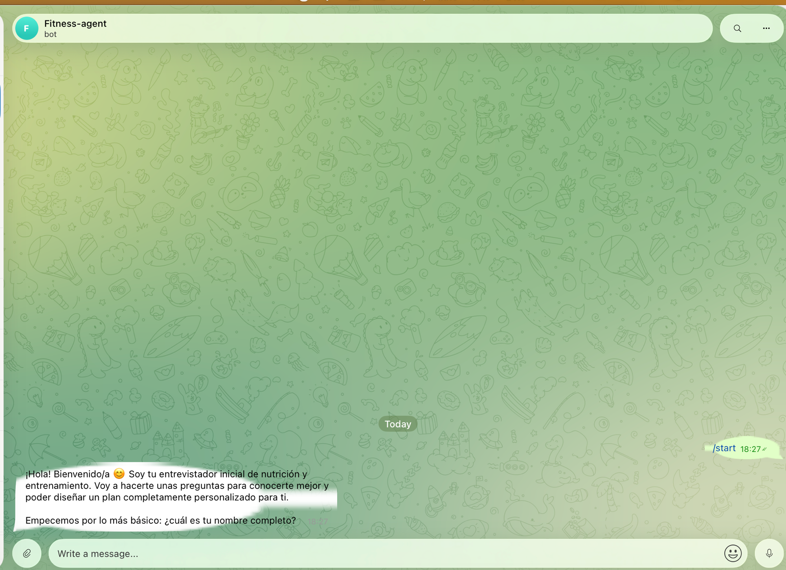
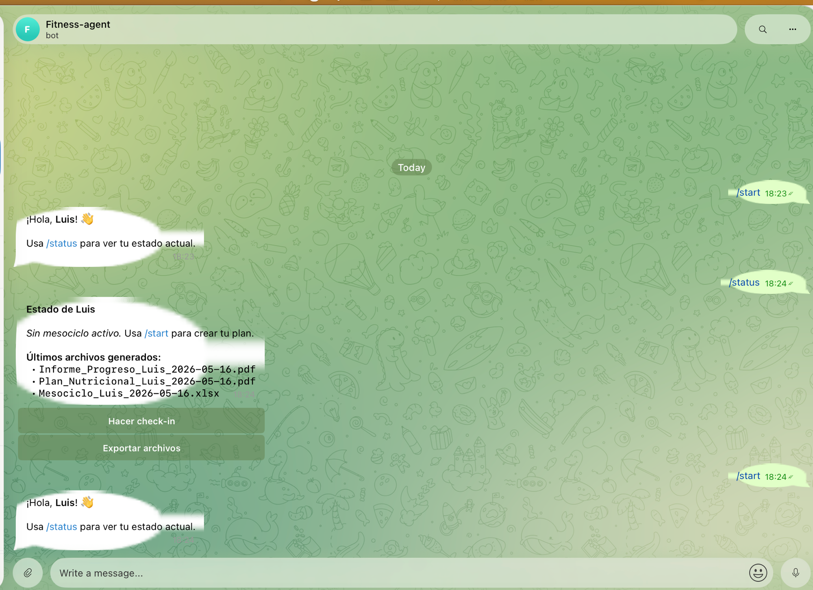

<div align="center">

# 🏋️ fitness-agents

**Multi-agent nutrition and personal training system powered by AI**

[](https://github.com/luissauco/fitness-agents/actions/workflows/ci.yml)
[](https://python.org)
[](https://anthropic.com)
[](https://langchain-ai.github.io/langgraph)
[](https://trychroma.com)
[](LICENSE)

[Español](README.md) · [Quick demo](#quick-demo) · [Telegram bot](#telegram-bot) · [Installation](#installation)

---

*Converts scientific evidence, technical content and user data into personalised training and nutrition plans — with biweekly check-ins.*

</div>

---

## What it does

`fitness-agents` is a pipeline of specialised agents that:

1. **Interviews the user** — adaptive conversational questionnaire (goals, availability, equipment, history)
2. **Analyses body photos** — visual body fat estimation, weak/strong points and postural notes
3. **Designs the mesocycle** — training programme in Excel organised by weekly microcycles
4. **Generates the nutrition plan** — PDF with macros, calorie distribution and nutrition strategy
5. **Tracks progress biweekly** — check-in with photos and weights, progress report PDF with weight chart

Everything orchestrated by a LangGraph graph with state persisted in SQLite, accessible via CLI or Telegram bot.

---

## Screenshots

<table>
<tr>
<td align="center" width="50%">

**Conversational onboarding**



*The intake agent interviews the user one question at a time*

</td>
<td align="center" width="50%">

**Status panel and files**



*`/status` shows the active mesocycle, generated files and quick actions*

</td>
</tr>
</table>

---

## Architecture

```
User (Telegram / CLI)
        │
        ▼
┌───────────────────────────────────────────────────────┐
│                   LangGraph Workflow                   │
│                                                       │
│  intake → assessment → training → nutrition           │
│                              ↓                        │
│                        schedule_checkin               │
│                              ↓                        │
│   checkin → progress ──────────────────────────────   │
│                ↓ new_mesocycle / adjust               │
│           training / nutrition                        │
└───────────────────────────────────────────────────────┘
        │                           │
        ▼                           ▼
  SQLite (state)           output/
  fitness.sqlite           ├── Mesociclo_*.xlsx
  state.sqlite             ├── Plan_Nutricional_*.pdf
                           └── Informe_Progreso_*.pdf
        │
        ▼
  ChromaDB (RAG)
  Fitness knowledge base in Spanish
```

Each agent uses **Claude Opus 4.7** with adaptive thinking and queries the RAG base before generating its structured Pydantic output. The Telegram bot is a pure presentation layer — it calls the same graph as the CLI.

---

## Features

| Area | Details |
|------|---------|
| **Agents** | Conversational intake, visual body assessment, mesocycle design, nutrition planning, progress analysis |
| **RAG** | Local ChromaDB, multilingual embeddings, filters by topic/author/reliability, YouTube ingestion |
| **Outputs** | Excel mesocycle (programme + microcycles), nutrition PDF, progress PDF with weight chart |
| **Persistence** | SQLite for profile, assessments, mesocycles, plans and progress logs |
| **Orchestration** | LangGraph with SQLite checkpoints, per-user state, conditional routing |
| **Interfaces** | CLI (`fitness`) + Telegram bot with whitelist and admin |
| **Quality** | Pydantic v2, structured outputs with retries, ruff, pytest |

---

## Quick demo

```bash
# Installation
curl -LsSf https://astral.sh/uv/install.sh | sh
uv sync --extra dev
cp .env.example .env  # add ANTHROPIC_API_KEY

# Knowledge base
uv run fitness-kb index-all
uv run fitness-kb search "volume periodisation for hypertrophy" --agent training -k 3

# Full flow
uv run fitness start --user-id me
uv run fitness status --user-id me
uv run fitness checkin --user-id me

# Regenerate files without re-running agents
uv run fitness export-mesocycle --user-id me
uv run fitness export-nutrition --user-id me
uv run fitness export-progress --user-id me

# Telegram bot
uv run fitness telegram
```

---

## Telegram bot

The bot exposes the full system via Telegram with whitelist-based authentication.

### Setup in 4 steps

1. Create a bot with [@BotFather](https://t.me/botfather) and copy the token
2. Get your chat ID with [@userinfobot](https://t.me/userinfobot)
3. Add to `.env`:
   ```env
   TELEGRAM_BOT_TOKEN=your_token
   TELEGRAM_ALLOWED_CHAT_IDS=123456789
   TELEGRAM_ADMIN_CHAT_ID=123456789
   ```
4. Start:
   ```bash
   uv run fitness telegram
   ```

### Commands

| Command | Description |
|---------|-------------|
| `/start` | Full onboarding or regenerates the plan if you already have a profile |
| `/checkin` | Guided biweekly check-in with photos and weights |
| `/status` | Active mesocycle, next check-in date and generated files |
| `/export` | Resends generated files (Excel + PDFs) |
| `/help` | Help with all commands |

---

## Installation

### Requirements

- Python 3.12+
- [uv](https://docs.astral.sh/uv/)
- Anthropic API key

### Steps

```bash
git clone https://github.com/luissauco/fitness-agents.git
cd fitness-agents

curl -LsSf https://astral.sh/uv/install.sh | sh
uv sync --extra dev

cp .env.example .env
# edit .env with your ANTHROPIC_API_KEY
```

### Environment variables

```env
# Required
ANTHROPIC_API_KEY=sk-ant-...

# ChromaDB
CHROMA_PERSIST_DIR=./src/knowledge/data/chroma_db
COLLECTION_NAME=fitness_knowledge

# Embeddings
EMBEDDING_MODEL=intfloat/multilingual-e5-small

# Telegram (optional)
TELEGRAM_BOT_TOKEN=
TELEGRAM_ALLOWED_CHAT_IDS=
TELEGRAM_ADMIN_CHAT_ID=
```

---

## Project structure

```
fitness-agents/
├── cli/                    # fitness-kb and fitness CLIs
├── src/
│   ├── agents/             # Specialised agents
│   │   ├── claude_client.py    # Async Claude API wrapper
│   │   ├── intake.py           # Conversational interview
│   │   ├── assessment.py       # Visual body assessment
│   │   ├── training.py         # Mesocycle design
│   │   ├── nutrition.py        # Nutrition plan
│   │   └── progress.py         # Progress analysis
│   ├── graph/              # LangGraph orchestration
│   │   ├── workflow.py         # State graph
│   │   ├── state.py            # FitnessState
│   │   └── checkpoints.py     # SQLite persistence
│   ├── knowledge/          # RAG base
│   │   ├── retriever.py        # Semantic search
│   │   ├── indexer.py          # ChromaDB indexing
│   │   └── sources/            # Source registry
│   ├── generators/         # File generators
│   │   ├── excel_mesocycle.py  # Excel with openpyxl
│   │   ├── pdf_nutrition.py    # PDF with reportlab
│   │   └── pdf_progress.py     # PDF with matplotlib chart
│   ├── models/             # Pydantic domain models
│   ├── db/                 # SQLite repositories
│   ├── config/             # Settings (pydantic-settings)
│   └── telegram_bot/       # Telegram bot
│       ├── handlers/           # Commands and callbacks
│       ├── services/           # WorkflowRunner, UserMapping, Scheduler
│       └── messages/           # Response texts
└── tests/                  # pytest suite
```

---

## Tech stack

| Layer | Technology |
|-------|-----------|
| LLM | Claude Opus 4.7 (Anthropic) |
| Orchestration | LangGraph 0.2 with SQLite checkpointer |
| RAG | ChromaDB + sentence-transformers (multilingual-e5-small) |
| Validation | Pydantic v2 |
| Bot | python-telegram-bot 21 |
| Excel | openpyxl |
| PDF | reportlab + matplotlib |
| CLI | Typer + Rich |
| Ingestion | yt-dlp + faster-whisper |
| Tests | pytest + ruff |
| Dep management | uv |

---

## Quality

```bash
uv run ruff check .
uv run ruff format .
uv run pytest
```

The suite covers chunking, indexing, retrieval, registry sync, domain models, agents, persistence and the LangGraph graph.

---

## Roadmap

See [ROADMAP.en.md](ROADMAP.en.md) for the full plan. Most useful contributions right now:

- Add scientific sources with clean metadata
- Create agent test cases with LLM mocks
- Improve agent prompts with more RAG context
- Web interface (alternative to the Telegram bot)

## Contributing

Read [CONTRIBUTING.en.md](CONTRIBUTING.en.md) to set up the environment, run checks and propose changes. Spanish version: [CONTRIBUTING.md](CONTRIBUTING.md).

---

## License

MIT — see [LICENSE](LICENSE).

---

<div align="center">

Built with [Claude](https://anthropic.com) · [LangGraph](https://langchain-ai.github.io/langgraph) · [ChromaDB](https://trychroma.com)

</div>
