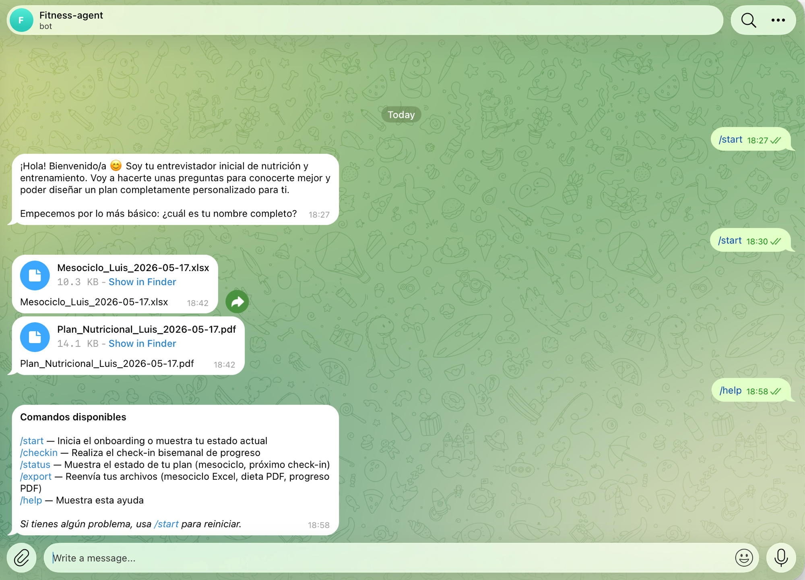

<div align="center">

# 🏋️ fitness-agents

**Sistema multi-agente de nutrición y entrenamiento personal con IA**

[](https://github.com/luissauco/fitness-agents/actions/workflows/ci.yml)
[](https://python.org)
[](https://anthropic.com)
[](https://langchain-ai.github.io/langgraph)
[](https://trychroma.com)
[](LICENSE)

[English](README.en.md) · [Demo rápida](#demo-rápida) · [Telegram bot](#bot-de-telegram) · [Instalación](#instalación)

---

*Convierte evidencia científica, divulgación técnica y datos del usuario en planes de entrenamiento y nutrición personalizados — con seguimiento bisemanal.*

</div>

---

## ¿Qué hace?

`fitness-agents` es un sistema de agentes especializados que:

1. **Entrevista al usuario** — cuestionario conversacional adaptativo (objetivos, disponibilidad, equipamiento, historial)
2. **Analiza fotos corporales** — estimación visual de % graso, puntos débiles/fuertes y notas posturales
3. **Diseña el mesociclo** — programa de entrenamiento en Excel organizado por microciclos semanales
4. **Genera el plan nutricional** — PDF con macros, distribución calórica y estrategia de nutrición
5. **Hace seguimiento bisemanal** — check-in con fotos y pesos, informe de progreso en PDF con gráfica

Todo orquestado por un grafo LangGraph con estado persistido en SQLite, accesible por CLI o bot de Telegram.

---

## Capturas

<div align="center">



*Flujo completo: onboarding → mesociclo Excel + plan nutricional PDF generados → ayuda de comandos*

</div>

---

## Arquitectura

```
Usuario (Telegram / CLI)
        │
        ▼
┌───────────────────────────────────────────────────────┐
│                   LangGraph Workflow                   │
│                                                       │
│  intake → assessment → training → nutrition           │
│                              ↓                        │
│                        schedule_checkin               │
│                              ↓                        │
│   checkin → progress ──────────────────────────────   │
│                ↓ new_mesocycle / adjust               │
│           training / nutrition                        │
└───────────────────────────────────────────────────────┘
        │                           │
        ▼                           ▼
  SQLite (estado)          output/
  fitness.sqlite           ├── Mesociclo_*.xlsx
  state.sqlite             ├── Plan_Nutricional_*.pdf
                           └── Informe_Progreso_*.pdf
        │
        ▼
  ChromaDB (RAG)
  Base de conocimiento fitness en español
```

Cada agente usa **Claude Opus 4.7** con adaptive thinking y accede a la base RAG antes de generar su output estructurado (Pydantic). El bot de Telegram es una capa de presentación pura — llama al mismo grafo que usa el CLI.

---

## Características

| Área | Detalles |
|------|----------|
| **Agentes** | Intake conversacional, evaluación corporal visual, diseño de mesociclo, planificación nutricional, análisis de progreso |
| **RAG** | ChromaDB local, embeddings multilingüe, filtros por tema/autor/fiabilidad, ingesta desde YouTube |
| **Outputs** | Excel mesociclo (programa + microciclos), PDF nutrición, PDF progreso con gráfica de peso |
| **Persistencia** | SQLite para perfil, evaluaciones, mesociclos, planes y logs de progreso |
| **Orquestación** | LangGraph con checkpoints SQLite, estado por usuario, routing condicional |
| **Interfaces** | CLI (`fitness`) + bot de Telegram con whitelist y admin |
| **Calidad** | Pydantic v2, structured outputs con reintentos, ruff, pytest |

---

## Demo rápida

```bash
# Instalación
curl -LsSf https://astral.sh/uv/install.sh | sh
uv sync --extra dev
cp .env.example .env  # añade ANTHROPIC_API_KEY

# Base de conocimiento
uv run fitness-kb index-all
uv run fitness-kb search "periodización de volumen para hipertrofia" --agent training -k 3

# Flujo completo
uv run fitness start --user-id yo
uv run fitness status --user-id yo
uv run fitness checkin --user-id yo

# Regenerar archivos sin re-ejecutar agentes
uv run fitness export-mesocycle --user-id yo
uv run fitness export-nutrition --user-id yo
uv run fitness export-progress --user-id yo

# Bot de Telegram
uv run fitness telegram
```

---

## Bot de Telegram

El bot expone todo el sistema vía Telegram con autenticación por whitelist de chat IDs.

### Setup en 4 pasos

1. Crea un bot con [@BotFather](https://t.me/botfather) y copia el token
2. Obtén tu chat ID con [@userinfobot](https://t.me/userinfobot)
3. Añade a `.env`:
   ```env
   TELEGRAM_BOT_TOKEN=tu_token
   TELEGRAM_ALLOWED_CHAT_IDS=123456789
   TELEGRAM_ADMIN_CHAT_ID=123456789
   ```
4. Arranca:
   ```bash
   uv run fitness telegram
   ```

### Comandos

| Comando | Descripción |
|---------|-------------|
| `/start` | Onboarding completo o regenera el plan si ya tienes perfil |
| `/checkin` | Check-in bisemanal guiado con fotos y pesos |
| `/status` | Mesociclo activo, próximo check-in y archivos generados |
| `/export` | Reenvía los archivos generados (Excel + PDFs) |
| `/help` | Ayuda con todos los comandos |

---

## Instalación

### Requisitos

- Python 3.12+
- [uv](https://docs.astral.sh/uv/)
- Clave API de Anthropic

### Pasos

```bash
git clone https://github.com/luissauco/fitness-agents.git
cd fitness-agents

curl -LsSf https://astral.sh/uv/install.sh | sh
uv sync --extra dev

cp .env.example .env
# edita .env con tu ANTHROPIC_API_KEY
```

### Variables de entorno

```env
# Obligatorio
ANTHROPIC_API_KEY=sk-ant-...

# ChromaDB
CHROMA_PERSIST_DIR=./src/knowledge/data/chroma_db
COLLECTION_NAME=fitness_knowledge

# Embeddings
EMBEDDING_MODEL=intfloat/multilingual-e5-small

# Telegram (opcional)
TELEGRAM_BOT_TOKEN=
TELEGRAM_ALLOWED_CHAT_IDS=
TELEGRAM_ADMIN_CHAT_ID=
```

---

## Estructura del proyecto

```
fitness-agents/
├── cli/                    # CLI fitness-kb y fitness
├── src/
│   ├── agents/             # Agentes especializados
│   │   ├── claude_client.py    # Wrapper async Claude API
│   │   ├── intake.py           # Entrevista conversacional
│   │   ├── assessment.py       # Evaluación corporal visual
│   │   ├── training.py         # Diseño de mesociclo
│   │   ├── nutrition.py        # Plan nutricional
│   │   └── progress.py         # Análisis de progreso
│   ├── graph/              # Orquestación LangGraph
│   │   ├── workflow.py         # Grafo de estados
│   │   ├── state.py            # FitnessState
│   │   └── checkpoints.py     # Persistencia SQLite
│   ├── knowledge/          # Base RAG
│   │   ├── retriever.py        # Búsqueda semántica
│   │   ├── indexer.py          # Indexación ChromaDB
│   │   └── sources/            # Registry de fuentes
│   ├── generators/         # Generadores de archivos
│   │   ├── excel_mesocycle.py  # Excel con openpyxl
│   │   ├── pdf_nutrition.py    # PDF con reportlab
│   │   └── pdf_progress.py     # PDF con gráfica matplotlib
│   ├── models/             # Modelos Pydantic del dominio
│   ├── db/                 # Repositorios SQLite
│   ├── config/             # Settings (pydantic-settings)
│   └── telegram_bot/       # Bot de Telegram
│       ├── handlers/           # Comandos y callbacks
│       ├── services/           # WorkflowRunner, UserMapping, Scheduler
│       └── messages/           # Textos de respuesta
└── tests/                  # Suite pytest
```

---

## Stack técnico

| Capa | Tecnología |
|------|-----------|
| LLM | Claude Opus 4.7 (Anthropic) |
| Orquestación | LangGraph 0.2 con checkpointer SQLite |
| RAG | ChromaDB + sentence-transformers (multilingual-e5-small) |
| Validación | Pydantic v2 |
| Bot | python-telegram-bot 21 |
| Excel | openpyxl |
| PDF | reportlab + matplotlib |
| CLI | Typer + Rich |
| Ingesta | yt-dlp + faster-whisper |
| Tests | pytest + ruff |
| Gestión de deps | uv |

---

## Calidad

```bash
uv run ruff check .
uv run ruff format .
uv run pytest
```

La suite cubre chunking, indexación, recuperación, sincronización del registry, modelos del dominio, agentes, persistencia y grafo LangGraph.

---

## Roadmap

Ver [ROADMAP.md](ROADMAP.md) para el plan completo. Las contribuciones más útiles ahora mismo:

- Añadir fuentes científicas con metadata limpia
- Crear casos de prueba para los agentes con mocks del LLM
- Mejorar los prompts de los agentes con más contexto RAG
- Interfaz web (alternativa al bot de Telegram)

## Contribuir

Lee [CONTRIBUTING.md](CONTRIBUTING.md) para configurar el entorno, ejecutar checks y proponer cambios.

---

## Licencia

MIT — ver [LICENSE](LICENSE).

---

<div align="center">

Construido con [Claude](https://anthropic.com) · [LangGraph](https://langchain-ai.github.io/langgraph) · [ChromaDB](https://trychroma.com)

</div>
